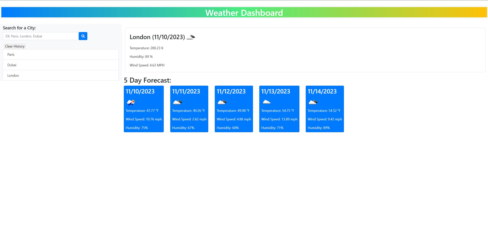

# WEATHER DASHBOARD

## Description

The Weather Dashboard allows users to search for specific cities and return current and future weather forcasts for that city. Data displayed includes humidity, the temperature, and humidity. Users can also save certain cities in a list for future viewing.

## Solution URL:
[WEATHER DASHBOARD URL Link:](https://kenwong356.github.io/Weather-Dashboard/)

## Screenshot:
### Figure 1. Screenshot
 
